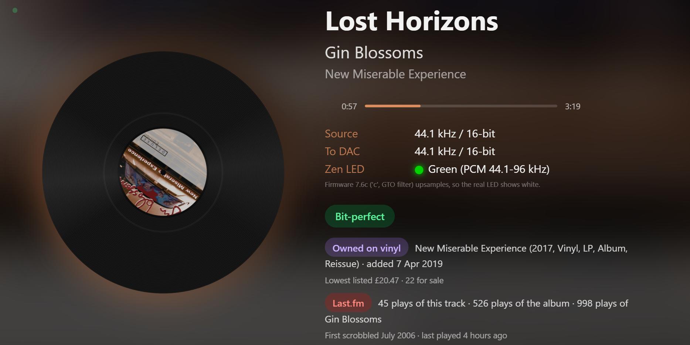

# Volumio bit-perfect check

[](https://github.com/roughtfish/volumio-bitperfect-check/actions/workflows/check.yml)

Two small tools for [Volumio](https://volumio.com) that show what's playing and confirm that the audio reaching your USB DAC is bit-perfect.

- **[Now-playing TV page](#now-playing-tv-page)**: a full-screen page served by the Volumio device itself, for a TV or any browser. It shows album art, the source and DAC formats, a bit-perfect badge, your Discogs vinyl collection and your Last.fm play history, and it can scrobble what Volumio plays to Last.fm.
- **[Windows terminal check](#windows-terminal-check)**: a double-click script for a Windows PC that shows the same information in a terminal window, with album art. It reads everything from the TV page, so there's nothing else to install.



---

## Now-playing TV page

A Python web server that runs on the Volumio device and serves a now-playing page at `http://<volumio-address>:8080`. It's designed for a TV browser, but works in any browser on your network.

### What it shows

- **Album art** with a blurred, slowly moving background, and accent colours picked from the cover. It can be shown in eight styles, including **pixel art**, **halftone**, a **spinning vinyl record**, a **CD** or a **cassette** (see [Cover styles](#cover-styles)).
- **Track, artist and album**, with long titles resized to fit
- **A progress bar** with elapsed time and track length
- **Source and DAC formats**: what Volumio is receiving and what is actually sent to the DAC
- **A bit-perfect badge**: green when the two match, red if something is resampling. It shows "Checking..." for the first few seconds of each track, because Volumio can briefly report a default format before the real details arrive. It shows amber **"Source unconfirmed"** when Volumio reports CD quality but the DAC is receiving more: Volumio sometimes misreports hi-res tracks, and in that case the **To DAC** figure is the reliable one.
- **The LED colour an iFi Zen DAC V2 should show** for the current format, with the DAC's firmware version detected automatically (only shown when an iFi DAC is connected)
- **Discogs** (optional):
  - **Owned on vinyl**: when the track or album is in your collection, with the pressing, the date you added it, and its current value (VG+ price suggestion, lowest listing and number for sale)
  - **Not owned on vinyl**: the lowest current price for a vinyl copy, and how many other records you own by the artist
- **Last.fm** (optional): your play counts for the track, album and artist, whether you've loved the track, when you first scrobbled it, and when you last played it
- **Up next**: the next tracks in Volumio's queue (not available with Tidal Connect, where the queue lives in the Tidal app). The details column shrinks slightly on busy tracks so it never overlaps.
- **Last.fm scrobbling** (optional): see [Last.fm scrobbling](#lastfm-scrobbling)
- **Tab icon and title**: in a desktop browser, the tab shows the current album cover and the track and artist
- **A status dot** in the top-left corner: faint green when everything's working, amber with a short note when something needs attention (see [Status dot](#status-dot))
- **An idle screen**: when nothing has played for a couple of minutes, a random record from your Discogs collection as a prompt to put something on the turntable (see [Idle screen](#idle-screen))

It also keeps LG TVs from dropping into their screen-saver (see [LG TV keep-alive](#lg-tv-keep-alive)), drifts the layout slightly to reduce the risk of burn-in, and reloads itself every 6 hours.

### Requirements

- A Volumio device with **Python 3.7 or newer** (included with Volumio 3)
- **SSH enabled on Volumio**, for the one-time install: open `http://<your-volumio>.local/dev` and click **Enable** next to SSH
- **Optional:** a [Discogs personal access token](https://www.discogs.com/settings/developers) and a [Last.fm API key](https://www.last.fm/api/account/create)

### Install

1. Log in to your Volumio device. The default password is `volumio`:
   ```
   ssh volumio@<volumio-address>
   ```
2. Run the installer:
   ```
   curl -fsSL https://raw.githubusercontent.com/roughtfish/volumio-bitperfect-check/main/nowplaying/install.sh | bash
   ```
   It downloads the page, creates `config.json`, and sets it up to start automatically. Enter your password (`volumio`) if it asks. Run it as the normal `volumio` user, not with `sudo`.
3. When it finishes, it shows two addresses. Open the **settings** one, `http://<volumio-address>:8080/settings`, and add your Discogs and Last.fm details (see [Settings](#settings)).
4. Open `http://<volumio-address>:8080` on your TV. Many TV browsers can't resolve `.local` names, so use the device's IP address, which the installer shows and which you can also find in Volumio under **Settings → Network**.

### Updating

The settings page tells you when a newer version is available: a banner at the top shows what's new and the command to update. It checks GitHub every 6 hours (or use **Check now**), and nothing is installed automatically. You can turn the check off under **Check GitHub for new versions**.

To update, run the installer again, the same way. It downloads the latest version and keeps your settings. Reload the page on the TV afterwards, since it keeps the old version open until you do.

If you're editing `nowplaying.py` yourself on Windows, `deploy.bat` copies it to Volumio, restarts the page and checks it started, in one double-click. It only sends `nowplaying.py`, so your settings on Volumio are never overwritten. Edit its `HOST` line first. It needs [PuTTY](https://www.putty.org) installed.

### Settings

Open `http://<volumio-address>:8080/settings` in any browser to change the settings. It also shows a status summary: how many Discogs records loaded, whether Last.fm is connected, the TV keep-alive status, and the detected DAC firmware. Changes take effect a few seconds after you save.

| Setting                  | What it does                                                           |
|--------------------------|------------------------------------------------------------------------|
| Discogs username         | Your Discogs username, for the vinyl badges                            |
| Discogs token            | Personal access token (needed for private collections and prices)     |
| Currency                 | Currency for Discogs prices, such as GBP, USD or EUR                   |
| Last.fm username         | Your Last.fm username, for play counts and history                     |
| Last.fm API key          | The API key (not the shared secret)                                    |
| Last.fm shared secret    | Needed for scrobbling; on the same Last.fm page as the API key         |
| Scrobble what Volumio plays | Turn scrobbling on or off (see [Last.fm scrobbling](#lastfm-scrobbling)) |
| Connect to Last.fm       | One-time approval on Last.fm's website, needed for scrobbling          |
| Show scrobble message for | How long the scrobble confirmation shows, 1 to 60 seconds (0 = off, default 8) |
| Keep it until the next track starts | Leave the confirmation up, slightly faded, until the track changes |
| LG TV keep-alive         | Stop an LG TV's screen-saver while the page is open                    |
| Only while playing       | Let the screen-saver run when music is paused                          |
| What to send the TV      | A one-pixel pointer nudge, or a colour button. On an LG C5 the Blue button works best |
| TV IP address            | Optional: normally found automatically                                 |
| Turn the TV screen off after | Minutes with nothing playing before the LG TV's screen goes off (default 15, 0 = never) |
| Pair the TV again        | Forget the TV's pairing, so it asks for permission again               |
| Update every             | How often the page refreshes, in seconds                               |
| Check GitHub for new versions | Show a notice on this page when a newer version is available (on by default) |
| Cover style              | One of eight styles (see [Cover styles](#cover-styles))                |
| Pixel and dot size       | For pixel art and halftone: 8 (very blocky) to 96 (fine) across, default 32 |
| Gaps between pixels      | Pixel art with thin gaps between the blocks, for a mosaic look         |
| Switch to spinning vinyl when I own it on vinyl | Show the record for tracks you own on vinyl, whatever the style |

Saved tokens are never shown on the page. Leave a token field blank to keep the saved value, or tick **Remove saved value** to clear it. Anyone on your home network can open the settings page, so don't expose port 8080 to the internet.

The settings are stored in `config.json` next to `nowplaying.py`, which you can also edit by hand (then run `sudo systemctl restart nowplaying`). **Never commit `config.json`, `lastfm_session.json` or `lgtv_key.json`.** They contain your tokens, your Last.fm connection and your TV's pairing key. The included `.gitignore` keeps them, and the Discogs cache files, out of the repository.

### Backup and restore

The **Backup** section at the bottom of the settings page saves your settings to a file, so you can get everything back quickly after a Volumio update or reinstall:

- **Download settings with keys** includes everything: your settings, Discogs token, Last.fm key, secret and connection, and TV pairing. Restoring it needs nothing re-entered. **Keep this file private.**
- **Download without keys** includes your settings only, and is safe to share.
- To restore, run the installer if the page isn't installed, open the settings page, choose the file under **Restore from a backup file** and click **Restore**. The page restarts with your settings. Restoring a backup made without keys keeps any keys that are already saved.

Never upload a backup made with keys to GitHub. The included `.gitignore` keeps `nowplaying-settings-*.json` files out of the repository.

### Last.fm scrobbling

The page can scrobble what Volumio plays to Last.fm. It runs in the background, so it works whether or not the page is open.

- **"Connect" services are skipped**, such as Tidal Connect and Spotify Connect, because their own apps already scrobble. Turn on Last.fm scrobbling in the Tidal app for those.
- **It follows Last.fm's rules**: a track counts once half of it has played, or four minutes for long tracks. Tracks under 30 seconds are skipped, and paused time doesn't count. It also updates your "now playing" status on Last.fm.
- **Scrobbles made while Last.fm can't be reached** are kept and sent once it's back.
- **It replaces mpdscribble**, which can't scrobble Tidal played through Volumio because the stream has no track details ("tags missing"). If you use mpdscribble, turn it off with `sudo systemctl disable --now mpdscribble` to avoid double scrobbles.

To set it up:

1. On the settings page, enter your Last.fm **API key** and **shared secret**. Both are shown when you create an API account at [last.fm/api/account/create](https://www.last.fm/api/account/create), and must come from the same account.
2. Tick **Scrobble what Volumio plays** and click **Save**.
3. After it restarts, click **Connect to Last.fm** and approve it on Last.fm's website. You'll be sent back to the settings page, which then says **Scrobbling as** your username. Your Last.fm password is never stored.

The connection is saved in its own file, `lastfm_session.json`, together with the API key and secret it was made with. That way, replacing or editing `config.json` can't disconnect scrobbling. **Disconnect** on the settings page deletes the file. Connections made with an older version, which were stored in `config.json`, are moved to the new file automatically.

**Scrobble confirmations:** once Last.fm has recorded a scrobble, a message such as **Scrobbled by Tidal: Farewell Transmission** appears in the top-left corner. It shows for 8 seconds by default, and you can change that, turn it off, or keep it up until the next track on the settings page. It works whichever app sent the scrobble, because it checks your Last.fm recent tracks every 30 seconds while music plays, so it can appear up to about 30 seconds after the scrobble. If three tracks in a row, each played past halfway, never appear on Last.fm, the [status dot](#status-dot) turns amber. Skipped tracks don't count.

To check it's working, the **Scrobbling** line in the settings status table shows the last track sent. `http://<volumio-address>:8080/api/scrobble` shows more detail, including which service is playing and whether it's being skipped.

### Cover styles

Choose how the album cover looks under **Cover style** on the settings page:

| Style | What it looks like |
|-------|--------------------|
| **Normal** | The album cover, framed with a soft glow in its accent colour |
| **Pixel art** | The cover drawn as large square blocks, like an old video game. Set how blocky under **Pixel and dot size** (8 is very chunky, 96 is fine, 32 is the default), and tick **Gaps between pixels** for a mosaic look |
| **Duotone** | The cover in two tones of its own main colour, like a poster print |
| **Black and white** | The cover in black and white, with a light film grain |
| **Halftone** | The cover made of coloured dots, bigger where it's brighter, like printed artwork. **Pixel and dot size** sets how many dots across |
| **Spinning vinyl** | The cover becomes the centre label of a black record, which spins at 33⅓ rpm while music plays and stops when you pause |
| **CD** | The cover printed on a silver disc, which spins while music plays |
| **Cassette** | The cover as the label on a cassette, with reels that turn while music plays |

The moving styles (vinyl, CD and cassette) also help against burn-in on OLED TVs.

**Switch to spinning vinyl when I own it on vinyl** is on by default. It uses your Discogs collection to show the spinning record whenever the track or album playing is one you own, whatever style you've chosen, so you can tell at a glance. The idle screen's suggested record also shows as a record, not spinning, since it's waiting to be put on. This needs Discogs set up.

### Live updates

The page keeps a live connection to Volumio, the same one Volumio's own web interface uses, so Volumio announces each change as it happens. New tracks, pause and play appear on the TV within about half a second.

- It works with both the older and newer versions of Volumio's live-update protocol (socket.io 2 and 3+).
- If the live connection isn't available, for example after a Volumio update changes it, the page falls back to checking every few seconds and keeps trying to reconnect. Nothing else is affected. The [status dot](#status-dot) shows "Live updates off" if it has been off for more than 2 minutes.
- The **Live updates** line on the settings page shows whether it's on, and `http://<volumio-address>:8080/api/live` shows more detail.

### Idle screen

When nothing has played for **2 minutes**, paused or stopped, the page shows a record from your Discogs collection instead, with the heading **"Why not put this one on?"**:

- The cover, title, artist, year and format, and when you added it to your collection
- How many times you've played the album on Last.fm, if you've set it up
- Only vinyl is suggested. CDs and other formats in your collection are skipped.
- A new record is picked every **10 minutes**, without repeating any of the last 30.

The normal view comes back as soon as music starts. Without Discogs set up, you get the normal paused view instead.

On an LG TV, the keep-alive's **Only while playing** option lets the screen-saver cover the idle screen. Untick it to see the idle screen, keeping in mind the burn-in advice under [LG TV keep-alive](#lg-tv-keep-alive).

### Status dot

A small dot in the top-left corner of the page. It's faint green when everything's working, and turns **amber** with a short note when something needs attention:

| Note                                | What to check                                                      |
|-------------------------------------|--------------------------------------------------------------------|
| Discogs: can't load your collection | Your username and token on the settings page                       |
| Discogs: no records loaded          | That your collection isn't empty or private without a token        |
| Last.fm: lookups failing            | Your API key on the settings page                                  |
| Scrobbling: not connected           | Click **Connect to Last.fm** on the settings page                  |
| Scrobbling: sending failed          | The Scrobbling line on the settings page for the error             |
| Scrobbling: Tidal Connect tracks aren't reaching Last.fm | The Last.fm connection in the Tidal app's settings |
| Scrobbling: the last 3 tracks didn't reach Last.fm | The Scrobbling line on the settings page, and your connection |
| TV keep-alive: can't reach the TV   | The LG TV line on the settings page, and that the TV allows network control |
| Live updates off: checking every few seconds | The Live updates line on the settings page. Everything still works, just less instantly |
| Volumio says it's playing, but nothing is reaching the DAC | Volumio is stuck or has lost the audio. Try **Restart Volumio** on the settings page |
| Volumio's details look stuck | Music is playing, but Volumio says it's stopped. Try **Restart Volumio** |
| Volumio keeps flipping between tracks | Volumio is reporting old tracks. Try **Restart Volumio** |

One-off hiccups don't count: a problem only shows while it has happened within the last 15 minutes, and a single album Last.fm doesn't know won't trigger it. The TV warning only appears while the TV has the page open.

### LG TV keep-alive

LG webOS TVs start a screen-saver after a couple of minutes in the built-in web browser, and it can't be turned off in the TV's settings. To stop it, the page can send the TV a tiny pointer nudge over your network every minute, the same way phone remote apps do.

- **The TV is found automatically.** When the LG browser opens the page, the server notes its address. Other browsers, such as your laptop's, are ignored. To set it yourself, enter it on the settings page.
- **It only runs while the page is open on the TV,** and by default only while music is playing, so the screen-saver still protects the screen when you pause.

To set it up:

1. On the TV, allow control over the network. On recent LG models this is under **Settings → General → Devices → External Devices**, called **LG Connect Apps** or similar.
2. Open the page on the TV and play something. Within about a minute, the TV asks whether to allow **Volumio now playing**. Accept it with the remote. The pairing is saved in `lgtv_key.json`, so you only do this once.
3. Check `http://<volumio-address>:8080/api/tv`. It should show `"paired": true` and the status **Keeping the TV awake**.

**Screen off when idle:** after 15 minutes with nothing playing, the page also switches the TV's screen off. The TV stays on and the picture comes back as soon as music plays. It only does this while the TV is showing the page, so it never switches the screen off while you're watching something else, and it doesn't nudge the TV while the screen is off. Change the time, or set it to 0 to turn this off, under **Turn the TV screen off after** on the settings page. The TV asks for permission to control its screen the first time; accept it with the remote. Newer LG TVs refuse the screen commands when asked directly, so the page also sends them through a blank notification that's opened and closed at once, which can cause a brief flicker as the screen switches. If the screen doesn't switch off, `http://<volumio-address>:8080/api/tv` shows the TV's reply in `screen_error`. On newer LG TVs, such as the 2025 C5, the TV doesn't accept the screen command directly, so the page sends it inside a notification that it opens and closes at once, the method remote-control apps use; you may see a brief flicker. That needs permission to show notifications: if you set up the page before version 1.8.3, tick **Pair the TV again** once and accept the pop-up on the TV.

**Tip:** the default pointer nudge can make the Magic Remote pointer flash up on screen. On an **LG C5**, choosing **BLUE button** under **What to send the TV** on the settings page worked better: it keeps the screen-saver away just as well, and no pointer appears. It's worth trying on other LG models too, but check the TV doesn't react to the Blue button in some other way. On an OLED, keeping the same layout on screen for hours still carries some risk of burn-in, even with the drift, so keep the brightness moderate and turn the TV off when you're not listening.

### Troubleshooting

- **Page won't load:** check the service is running with `systemctl status nowplaying`, and view its log with `journalctl -u nowplaying -n 30 --no-pager`.
- **Status dot is amber:** the note beside it says what's wrong. See [Status dot](#status-dot).
- **No idle screen:** it needs Discogs set up, and appears 2 minutes after playback stops. After updating, give it a minute to reload your collection, which includes the covers. On an LG TV, untick **Only while playing** or the screen-saver will cover it.
- **No vinyl badges:** check the status table on the settings page, or open `http://<volumio-address>:8080/api/discogs` for more detail. Give it a minute after starting, because it downloads your collection first.
- **No Last.fm badge:** check the status table on the settings page, and make sure you entered the API key rather than the shared secret.
- **Tracks not scrobbling:** check the Scrobbling line on the settings page for an error, and that it says "Scrobbling as" your username. Tidal Connect is skipped on purpose. If a Connect service isn't being skipped and you get double scrobbles, check `current_service` at `/api/scrobble`.
- **"Being resampled":** in Volumio, check **Settings → Playback Options**. Set **Resampling** to off and **Volume control mode** to **None**, and disable any DSP or equaliser plugins. Tidal Connect bypasses these settings, so a problem may only show up when playing through Volumio itself. After changing the mixer type, restart Volumio if nothing plays, and turn your DAC or amp down first, because **None** sends a full-level signal.
- **LG screen-saver still appears:** check the LG TV line on the settings page, or `http://<volumio-address>:8080/api/tv`. It shows whether the TV was found, paired and nudged. If the TV never asked for permission, check network control is enabled on the TV (step 1 of [LG TV keep-alive](#lg-tv-keep-alive)). For other TVs, running the page on a streaming stick with a kiosk browser (for example Fully Kiosk Browser with "Keep screen on") is more reliable.
- **TV screen doesn't turn off:** open `http://<volumio-address>:8080/api/tv`. `screen_method` shows how the screen was last switched (direct, or the notification workaround), and `screen_error` shows what the TV said if it refused. "401 insufficient permissions" means the pairing is missing a permission: tick **Pair the TV again** on the settings page, save, play some music, and accept the pop-up on the TV. It only switches the screen off while the TV is showing the page, and after the time set under **Turn the TV screen off after**.
- **Stopped working after a Volumio update:** major updates can remove the service. Run the installer again.
- **Volumio seems stuck** (old tracks showing, or details not updating): press **Restart Volumio** on the settings page. It restarts the Volumio PC, which takes a minute or two. It needs the live connection to Volumio; if that's down, restart it from Volumio's own menu or with `sudo reboot` over SSH.

---

## Windows terminal check

A double-click Windows script, `check-volumio.bat`, that shows the now-playing information in a terminal window and refreshes automatically. It reads everything from the [now-playing TV page](#now-playing-tv-page), so install that first.

### What it shows

- **Track, artist, album and position**
- **Source and DAC formats**, and whether playback is bit-perfect
- **Album art**: a real image in Windows Terminal (using Sixel), or coloured block art anywhere else
- **The LED colour an iFi Zen DAC V2 should show**, with its firmware (only shown when an iFi DAC is connected)
- **Discogs and Last.fm details**, if you've set them up on the TV page

### Requirements

- **Windows 10 or 11**
- **The now-playing TV page** installed on your Volumio (see [Install](#install))
- **Windows Terminal 1.22 or newer** for the real album art image. Older terminals fall back to block art automatically.

No SSH, PuTTY or password is needed.

### Setup

1. Download `check-volumio.bat`.
2. Open it in a text editor and set `$vol` to your Volumio's address, for example `volumio.local` or its IP address.
3. Double-click it.

### Settings

| Setting      | Default           | What it does                                                             |
|--------------|-------------------|--------------------------------------------------------------------------|
| `$vol`       | `volumiopc.local` | Your Volumio device's hostname or IP address                             |
| `$port`      | `8080`            | Port of the now-playing page                                             |
| `$artMode`   | `auto`            | `sixel` for a real image, `blocks` for coloured blocks, `auto` to choose |
| `$artPx`     | `288`             | Sixel image size in pixels (keep it a multiple of 6)                     |
| `$artWidth`  | `48`              | Block art width in characters                                            |
| `$infoWidth` | `58`              | Maximum width of the text column                                         |
| `$refresh`   | `20`              | Seconds between refreshes                                                |

Press any key to refresh straight away, or **Ctrl+C** to quit.

### Troubleshooting

- **"Could not reach the now-playing page":** check Volumio is on, the TV page is installed, and `$vol` is right. Try opening `http://<volumio-address>:8080` in a browser on the same PC.
- **Gibberish instead of album art:** your terminal doesn't support Sixel. Update Windows Terminal, or set `$artMode = 'blocks'`.
- **Image overlapping text or cut off:** make the window wider, or reduce `$artPx`.

---

## iFi Zen DAC V2 LED colours

When an iFi DAC is connected, both tools show the LED colour it should display, using the scheme from the Zen DAC V2 manual (v1.4):

| LED    | Format               |
|--------|----------------------|
| Green  | PCM 44.1 to 96 kHz   |
| Yellow | PCM 176.4 to 384 kHz |
| Cyan   | DSD64 / DSD128       |
| Blue   | DSD256               |

### Firmware detection

Both tools read the DAC's firmware version from its USB connection (the `bcdDevice` value, for example `7.6c`) and adjust the note under the LED colour:

| Firmware          | Example | Note shown                                                         |
|-------------------|---------|--------------------------------------------------------------------|
| **'c'** (GTO filter) | `7.6c`  | The GTO filter upsamples inside the DAC, so the real LED shows white whatever the source |
| **'b'** (no MQA)  | `7.6b`  | The LED should match the colour shown                              |
| Standard          | `7.60`  | The LED should match the colour shown                              |

The variant is taken from the last character of the version number, which is how iFi names its firmware. If you switch firmware, the note updates within a minute. The 'c' firmware's upsampling happens inside the DAC, after the data arrives, so it doesn't affect whether playback to the DAC is bit-perfect.

Older manuals use a different colour scheme, so your DAC may not match this table exactly.

## How it works

- Track details and the source format come from Volumio's REST API (`/api/v1/getState` and `/api/v1/getQueue`).
- The format sent to the DAC comes from `/proc/asound/card*/pcm*p/sub0/hw_params` on the Volumio device.
- The Windows script reads everything from the TV page's `/api/status`, so it needs no login.
- The iFi firmware version comes from the DAC's USB details in `/sys/bus/usb/devices` (vendor ID `20b1`, the XMOS USB chip iFi uses).
- Vinyl information comes from the Discogs API, and play history from the Last.fm API. Scrobbling uses Last.fm's signed API, with a session key from the one-time "Connect to Last.fm" approval, stored in `lastfm_session.json`. Both are cached so the page makes as few requests as possible.
- The LG keep-alive uses the TV's local network control interface (the same one phone remote apps use) to send pointer input.

## Versions and changes

The version number is shown at the bottom of the settings page, and the installer reports it when it finishes. See the [changelog](CHANGELOG.md) for what's new in each version.

## Tests

Every upload is checked automatically on GitHub (the **Check** badge at the top shows the latest result). The check:

- runs the tests in `tests/` on several Python versions
- checks the page's JavaScript, `install.sh` and the PowerShell in `check-volumio.bat` for mistakes
- checks the line endings of the `.bat` and `.sh` files
- fails if `config.json`, `lastfm_session.json`, `lgtv_key.json`, a settings backup or anything that looks like an API key has been uploaded

To run the tests yourself, from the repository folder:

```
python -m unittest discover -s tests -v
```

They only use Python's standard library, and simulate Volumio, Discogs, Last.fm and the TV, so they don't need any of them.

## Licence

MIT. See [LICENSE](LICENSE).
